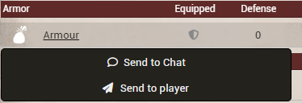
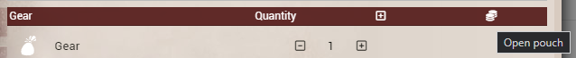

# Genesys FFG Options Enhancer

**Genesys FFG Options Enhancer** is a quality‑of‑life module for **Foundry VTT** designed mainly for Genesys RPG system.  
It adds handy GM and player tools, a currency manager, and QoL automations.

---

## Features

###  GM Tools
####  Roll Request System
- Request skill rolls directly from selected online players
- Choose:
  - Skill
  - Difficulty
  - Challenge (upgrades)
  - Setback
  - Boost
  - Roll mode (public / private / blind / self)
- Players receive a popup and roll using the **native system roll dialog**
- Fully respects Genesys dice upgrade rules

Accessible from **Token Controls → Request a Roll**

---

###  Player Tools
####  Talent & Spell Search
- Advanced searchable talent/spell browser
- Searches:
  - Item talents
  - Talents embedded in species / specializations
- Live filtering by name and description
- Highlighted search terms
- Expand / collapse descriptions
- Optional hiding of talents without descriptions
- Send talent to chat
- Cast spells / talents:
  - The module looks for an *activation cost* inside the description. The label text is **configurable** in settings (default: “Koszt aktywacji”; alias supported: “Activation Cost”).  
  - Supports multiple **levels/variants** — shows a picker when several costs are present.  
  - **Mana = Force Pool**: the cost is paid from the actor’s Force Pool. If the actor doesn’t have enough, a “Not enough mana” warning is shown and **nothing is posted to chat**.

Accessible from **Token Controls → Talent Search**

---

#### Item Transfer Between Players
- Right‑click items on a character sheet to send **Armour / Gear / Weapons** to another online player.
- Recipient may **Accept** or **Decline**.
- Transfer is executed with GM authority (no permission pitfalls).

---

### Economy
#### Currency Manager

**Sending modes (when transferring coins):**
- **Send selected coins:** sends exactly the denominations you specified (e.g., 2 Gold + 3 Silver). If you lack the exact coins, the transfer is blocked. No auto‑conversion is performed.
- **Send by value (auto change-making):** removes the equivalent **value** from the sender using conversions (Gold↔Silver↔Bronze) and credits the recipient with the same value. The recipient’s balance is recomposed using the module’s denominations (they may receive a different mix of coins than the unit you selected).

Examples:
- You choose **10 Silver** and select **by value** while you only have **1 Gold** – the module will break the gold into silver and complete the transfer.
- You choose **10 Silver** and select **selected coins** while you have only **1 Gold** – the transfer will **not** go through, because you don’t hold the exact silver coins.

A minimal in‑game coin manager with conversion helpers.

- Add / remove / exchange coins (Gold ↔ Silver ↔ Bronze).
- Conversion ratios are configurable (see Settings).
- Auto‑refresh when balances change.

AcceAccessible from **Character sheet (Gear & Equipmnet tab)** — currency symbol on Gear tab.

---

## Module Settings

> All feature toggles auto‑reload the world for every connected client when changed and saved.

### Language
- **`language`** — Module UI language (English / Polish). Changing this reloads the client UI.

### Talent & Spell Search
- **`activationCostLabel`** — Default label searched inside spell/talent descriptions to detect the activation cost.  
  - Default: `Koszt aktywacji` (built‑in alias: `Activation Cost`). Comparison is case‑insensitive.

### Feature Toggles
- **`enableCurrency`** — Enable Currency Manager (UI and hooks). *Default: on.*
- **`enableItemSend`** — Enable Item Transfer between players. *Default: on.*
- **`enableTalentSearch`** — Enable Talent/Spell Search tool. *Default: on.*
- **`enableRequestRolls`** — Enable Request‑a‑Roll tool (GM). *Default: on.*

### Currency Manager
- **`silverPerGold`** — How many silver equal **1 gold** (default: 10).
- **`copperPerSilver`** — How many copper equal **1 silver** (default: 10).

---

## Supported Systems
- ✅ **Star Wars FFG**

---

## Contributing / New Languages

Want to add a new translation? Awesome! Please **contact me** and I’ll help you get started. The language dictionaries live in `lang/en.json` and `lang/pl.json` and the module uses a simple `Lang.t("...")` lookup everywhere.
