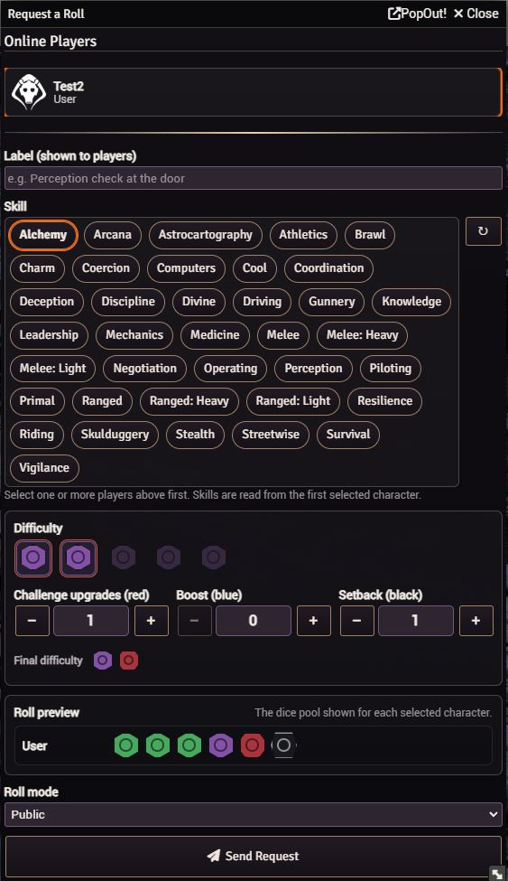
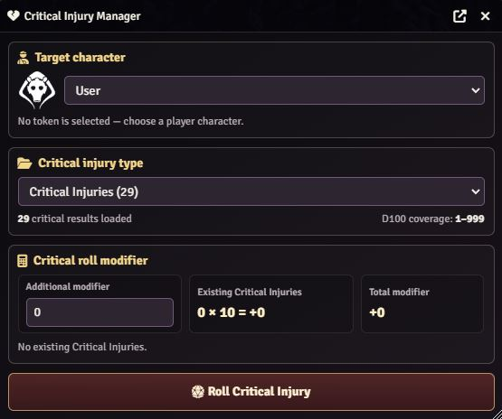
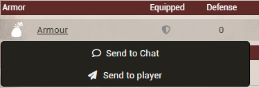
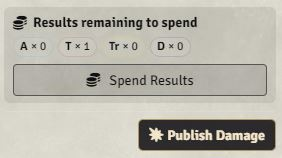
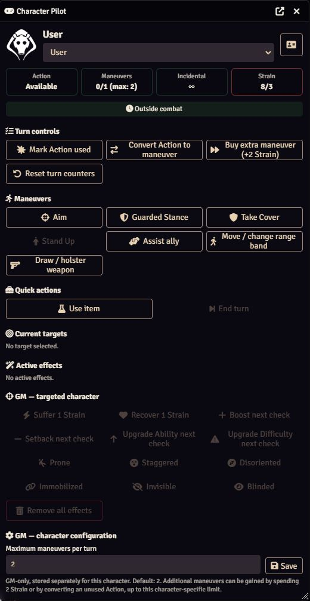
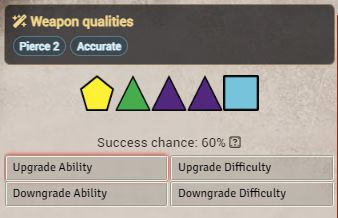
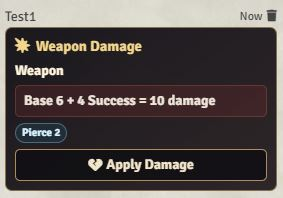
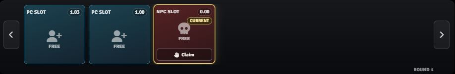
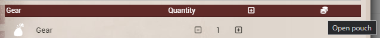

# Genesys FFG Options Enhancer

**Genesys FFG Options Enhancer** is a quality-of-life module for **Foundry VTT** designed mainly for the Genesys RPG / Star Wars FFG system.  
It adds GM and player tools, combat automation, initiative utilities, inventory and currency management, and other QoL improvements while relying on the system's native mechanics wherever possible.

---

## Features

### GM Tools

#### Roll Request System
- Request skill rolls directly from selected online players.
- Choose:
  - Skill
  - Difficulty
  - Challenge (upgrades)
  - Setback
  - Boost
  - Roll mode (public / private / blind / self)
- Players receive a popup and roll using the **native system roll dialog**.
- Fully respects Genesys dice upgrade rules.

Accessible from **Token Controls → Request a Roll**

---

#### Critical Injury Manager
- Dedicated GM tool for resolving Critical Injuries.
- Select a token or choose a player character from the list.
- Choose which imported Critical Injury table/type should be used.
- Enter an additional modifier before rolling.
- Existing Critical Injuries automatically add +10 each to the roll.
- The rolled Critical Injury is added directly to the selected character.
- Designed to work with imported Critical Injury entries stored in Foundry folders.

Accessible from **Token Controls → Critical Injuries**

---

#### GM Roll Fudging
- Optional GM-only tool for secretly changing a failed weapon attack into a successful one.
- The GM can choose how many net Successes the forced result should contain.
- Default value: 1 Success.
- Damage is recalculated using the forced Success count.
- Players see the result as a normal successful attack and are not informed that it was changed.
- Controlled by a separate setting and can be fully disabled.

---

### Player Tools

#### Talent & Spell Search
- Advanced searchable talent/spell browser.
- Searches:
  - Item talents
  - Talents embedded in species / specializations
- Live filtering by name and description.
- Highlighted search terms.
- Expand / collapse descriptions.
- Optional hiding of talents without descriptions.
- Send talent to chat.
- Cast spells / talents:
  - The module looks for an *activation cost* inside the description. The label text is configurable in settings (default: “Koszt aktywacji”; alias supported: “Activation Cost”).
  - Supports multiple levels/variants - shows a picker when several costs are present.
  - **Mana = Force Pool**: the cost is paid from the actor’s Force Pool. If the actor doesn’t have enough, a “Not enough mana” warning is shown and nothing is posted to chat.

Accessible from **Token Controls → Talent Search**

---

#### Item Transfer Between Players
- Right-click items on a character sheet to send **Armour / Gear / Weapons** to another online player.
- Choose how many items from a stack should be transferred.
- Recipient may Accept or Decline.
- Transfer is executed with GM authority to avoid permission conflicts.
- If the recipient already owns a compatible item with the same name, the quantity can be increased instead of creating another duplicate item.

  

---

### Combat & Dice Automation

#### Spend Results System
- Spend narrative dice results directly from roll messages.
- Supports:
  - Advantage
  - Threat
  - Triumph
  - Despair
- Positive and negative result spending is handled according to player / GM permissions.
- Spending options change depending on combat or social context.
- Supports automated effects such as:
  - Recovering or suffering Strain
  - Boost and Setback dice on future checks
  - Ability and Difficulty upgrades
  - Effects targeting opponents or allies
  - Critical Injuries
  - Weapon quality activations
- GMs can define additional custom spending options for their campaign.
- Spent symbols are tracked so they cannot be spent twice.

  

---

#### Character Pilot
- Dedicated combat control panel for commonly used actions and maneuvers.
- Tracks current turn resources such as Action and Maneuvers.
- Supports common actions such as:
  - Aim
  - Guarded Stance
  - Take Cover
  - Movement
  - Standing up
  - Drawing / holstering weapons
  - Assisting allies
  - Using inventory items
  - Suffering / recovering Strain
  - Purchasing an additional maneuver with Strain
  - Converting an unused Action into a maneuver
  - Ending the turn
- Handles common temporary combat effects and statuses.
- Temporary Boost / Setback dice and Ability / Difficulty upgrades can be automatically consumed on the next applicable check.
- GM controls are available for target handling and campaign-specific maneuver limits.

  

---

#### Weapon Roll Automation
- Adds automation for weapon attacks and weapon qualities.
- Supported qualities include:
  - Accurate
  - Auto-Fire
  - Blast
  - Breach
  - Burn
  - Concussive
  - Cortosis
  - Cumbersome
  - Defensive
  - Deflection
  - Disorient
  - Ensnare
  - Guided
  - Inaccurate
  - Inferior
  - Ion
  - Knockdown
  - Limited Ammo
  - Linked
  - Pierce
  - Prepare
  - Slow-Firing
  - Stun
  - Stun Damage
  - Sunder
  - Superior
  - Tractor
  - Vicious
- Passive qualities such as **Accurate, Inaccurate, Cumbersome, Superior and Inferior** can modify the dice pool automatically.
- Active weapon qualities integrate with the Spend Results system where appropriate.

  

---

#### Automatic Damage Handling
- Successful weapon attacks can be resolved directly from the original roll message.
- Damage uses **Weapon Base Damage + uncancelled Successes**.
- Supports defensive calculations involving:
  - Soak
  - Vehicle Armor
  - Pierce
  - Breach
  - Cortosis
  - Stun Damage
  - Ion damage
  - Multiple hits from qualities such as Auto-Fire and Linked
- Player attacks show a GM-only **Apply Damage** button directly on the original attack roll.
- GM attacks use a GM-only **Publish Damage** control before presenting the result to players.
- Duplicate damage application is prevented.

  

---

#### Additional Defense Skills
- Configure custom or additional skills to automatically use a target's Defense.
- Each configured skill can independently use:
  - Melee Defense
  - Ranged Defense
- When the configured skill is rolled against a targeted token, the appropriate Defense value is added to the roll as Setback dice.
- Native combat skills already handled by the system are excluded from this configuration to prevent Defense from being applied twice.
- When multiple targets are involved, the module follows the system approach and uses the relevant highest Defense value.

---

#### Combat Carousel
- Optional initiative carousel displayed at the top of the game canvas during combat.
- Designed specifically for the Genesys / StarWarsFFG Generic Initiative Slot system.
- Displays:
  - PC initiative slots
  - NPC initiative slots
  - Free slots
  - Claimed slots
  - Current active slot
  - Current round
- Appropriate free slots can be claimed directly from the carousel.
- Claimed slots display the portrait and name of the character that claimed them.
- Hidden NPC information remains hidden from players.
- Clicking a claimed character can select and focus its token.
- The carousel automatically follows the active initiative slot.
- GM navigation controls allow moving to the previous or next combat turn directly from the carousel.

  

---

### Economy

#### Currency Manager

**Sending modes (when transferring coins):**
- **Send selected coins:** sends exactly the denominations you specified (e.g., 2 Gold + 3 Silver). If you lack the exact coins, the transfer is blocked. No auto-conversion is performed.
- **Send by value (auto change-making):** removes the equivalent **value** from the sender using conversions (Gold↔Silver↔Bronze) and credits the recipient with the same value. The recipient’s balance is recomposed using the module’s denominations (they may receive a different mix of coins than the unit you selected).

Examples:
- You choose **10 Silver** and select **by value** while you only have **1 Gold** – the module will break the gold into silver and complete the transfer.
- You choose **10 Silver** and select **selected coins** while you have only **1 Gold** – the transfer will **not** go through, because you don’t hold the exact silver coins.

A minimal in-game coin manager with conversion helpers.

- Add / remove / exchange coins (Gold ↔ Silver ↔ Bronze).
- Conversion ratios are configurable (see Settings).
- Auto-refresh when balances change.

Accessible from **Character sheet (Gear & Equipment tab)** — currency symbol on the Gear tab.

  

---

## Module Settings

> All feature toggles auto-reload the world for every connected client when changed and saved.

### Language
- **`language`** — Module UI language (English / Polish). Changing this reloads the client UI.

### Talent & Spell Search
- **`activationCostLabel`** — Default label searched inside spell/talent descriptions to detect the activation cost.
  - Default: `Koszt aktywacji` (built-in alias: `Activation Cost`). Comparison is case-insensitive.

### Combat & Automation
- Additional Defense Skills can be configured separately for **Melee Defense** and **Ranged Defense**.
- GM Roll Fudging has its own independent enable/disable setting.
- Combat Carousel has its own independent enable/disable setting.
- Major combat automation systems can be enabled or disabled independently according to the needs of the world.

### Feature Toggles
- **`enableCurrency`** — Enable Currency Manager (UI and hooks). *Default: on.*
- **`enableItemSend`** — Enable Item Transfer between players. *Default: on.*
- **`enableTalentSearch`** — Enable Talent/Spell Search tool. *Default: on.*
- **`enableRequestRolls`** — Enable Request-a-Roll tool (GM). *Default: on.*
- Additional feature toggles are available for the module's combat, damage, result-spending, carousel and GM utility systems.

### Currency Manager
- **`silverPerGold`** — How many silver equal **1 gold** (default: 10).
- **`copperPerSilver`** — How many copper equal **1 silver** (default: 10).

---

## Localization

- Full module UI is available in **English** and **Polish**.
- Buttons, settings, dialogs, warnings, tooltips and module-specific combat controls are localized.
- Translation files are stored in:
  - `lang/en.json`
  - `lang/pl.json`

---

## Supported Systems

- ✅ **Star Wars FFG**

The module is designed to use the StarWarsFFG system's existing dialogs, actors, combat slots and roll mechanics wherever possible instead of replacing them.

---

## Contributing / New Languages

Want to add a new translation? Awesome! Please **contact me** and I’ll help you get started. The language dictionaries live in `lang/en.json` and `lang/pl.json` and the module uses a simple `Lang.t("...")` lookup everywhere.
